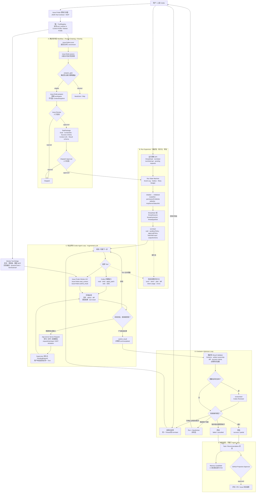
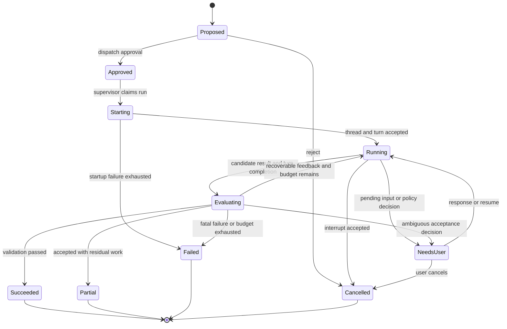

# Agent Loop Target Architecture

Status: Implemented architecture and current runtime contract.

This document is the authoritative architecture for the Issue Finder agent loop. [`usage.md`](./usage.md)
describes the operator-facing commands. Historical files under `docs/superpowers/specs/` explain
earlier decisions but do not constrain this architecture.

The target deliberately does not preserve old package versions, status vocabularies, adapter
layers, local dispatch databases, or command aliases merely for compatibility. When a slice is
replaced, its obsolete path is removed in the same change.

## Product Boundary

Issue Finder is not a second autonomous coding agent. It is the deterministic control plane around
one bounded Codex agent loop:

- Issue Finder owns discovery, assessment, preparation, approvals, durable run state, runtime
  supervision, result evaluation, and terminal projections.
- Codex owns open-ended planning, repository inspection, editing, command execution, and recovery
  from tool feedback inside an approved workspace.
- Humans own issue selection, dispatch approval, privileged actions, ambiguous product decisions,
  and external publication.
- GitHub, memory, and A2A are downstream projections or gateways. They are not alternate agent
  loops.

This follows the progression in Anthropic's
[Building Effective Agents](https://www.anthropic.com/engineering/building-effective-agents): use
fixed workflows where the path is known, reserve an agent for steps that cannot be hard-coded, and
close the loop with environment feedback, explicit stopping conditions, and a carefully designed
agent-computer interface.

## Complete Target Flow



## Building Block Selection

| Building block | Target use | Boundary |
| --- | --- | --- |
| Augmented LLM | Codex plus workspace, context, built-in tools, Issue Finder tools, and skills | The only open-ended agent loop |
| Prompt chaining | `scout -> assess -> prepare -> review -> dispatch` | Deterministic application workflow |
| Routing | Prepare eligibility, risk class, execution strategy, and review policy | Prefer code and typed facts over LLM classification |
| Parallelization | Candidate enrichment and independent evaluator lanes | Never introduces multiple writers for one workspace |
| Evaluator-optimizer | Codex produces a result; deterministic checks and optional review provide retry feedback | Bounded by attempt, time, and token budgets |
| Autonomous agent | Tool/observation loop within one approved Codex thread | Cannot approve itself or publish externally |
| Orchestrator-workers | Deferred | Added only after single-worker evals prove a need |

Multi-worker decomposition is not part of the core target. `thread/fork`, Codex subagents, or a
central LLM orchestrator may be evaluated later, but they must not be prerequisites for completing
the single-worker vertical loop.

## State Model

### Run state



`NeedsUser` is a resumable run state, not an outcome. A run may enter it any number of times and
later succeed. Only `Succeeded`, `Partial`, `Failed`, and `Cancelled` are terminal.

### State ownership

| State | Authoritative owner | Derived consumers |
| --- | --- | --- |
| Candidate and assessment | `recommendation/*` | candidate board, prepare |
| Prepare eligibility | `prepare_gate.rs` | CLI, tools, daily workflow |
| Context snapshot | preparation/context owner | task package, Codex worker |
| Review and dispatch approval | dispatch control plane | supervisor |
| Run, turn, item, pending request | run supervisor | CLI, JSON tools, UI |
| Candidate result and evaluation | evaluator | terminal outcome |
| Terminal outcome | dispatch outcome owner | recommendation, memory, GitHub, board |
| Approved memory hint | `memory/*` | ranking and later task preparation |

No projector may write back into its source table. Derived state must be rebuildable from its
authoritative facts.

## Tool Surfaces

The tool registry has one schema and one execution implementation. JSON CLI, MCP, and experimental
Codex dynamic tools are adapters over that registry; they do not duplicate prepare, dispatch,
context, or evaluation rules.

### Control profile

The user or parent Codex receives workflow and operator tools:

```text
issue-finder.status
issue-finder.scout
issue-finder.assess
issue-finder.prepare
issue-finder.read_context
issue-finder.dispatch_review_*
issue-finder.dispatch
issue-finder.dispatch_approve
issue-finder.dispatch_reject
issue-finder.dispatch_execute
issue-finder.dispatch_status
issue-finder.dispatch_pending_requests
issue-finder.dispatch_respond
issue-finder.dispatch_steer
issue-finder.dispatch_interrupt
issue-finder.dispatch_sync
issue-finder.github_*
issue-finder.memory_*
```

The last five runtime-control tools are target additions. They expose supervisor operations; they
do not call app-server from a second runtime path.

### Worker profile

The dispatched Codex worker receives only task-local Issue Finder tools:

```text
issue-finder.read_context
issue-finder.submit_result
```

`read_context` may read only context sections named by the immutable snapshot. `submit_result`
accepts the task package's result schema and is scoped to the active `runId`, `issueTaskId`, and
`packageId`. The worker does not receive discovery, approval, dispatch, GitHub, memory-control, or
agent-launch tools. This prevents recursive dispatch and keeps the ACI small enough to test
exhaustively.

An isolated stdio MCP server is the production bridge. Codex clients support MCP configuration and
app-server can require an MCP server during thread startup. App-server `dynamicTools` may be used
for experiments, but it remains behind an explicit experimental capability and cannot be the only
production path. See the official [Codex MCP](https://developers.openai.com/codex/mcp/) and
[app-server](https://developers.openai.com/codex/app-server/) documentation.

### Tool identity and isolation

Tool semantics are stable, but transport names do not need to be identical:

| Semantic tool ID | JSON adapter | Worker MCP | Experimental dynamic tool |
| --- | --- | --- | --- |
| Read task context | `issue-finder.read_context` | server `issue_finder`, tool `read_context` | `issue_finder_read_context` |
| Submit a candidate result | `issue-finder.submit_result` | server `issue_finder`, tool `submit_result` | `issue_finder_submit_result` |

The adapter owns this lossless name mapping because app-server dynamic tool names must satisfy its
wire naming constraints. Schemas, validation, authorization, and execution still come from the
same registry entry.

The worker MCP server starts with `profile=worker` and a run-scoped capability binding its calls to
one run, package, snapshot, and workspace. Its tool discovery response contains only the worker
profile. The parent/control MCP server is a different process or endpoint with a different profile;
its catalog is never inherited by a dispatched worker.

The supervisor launches Codex with a run-scoped MCP configuration and verifies
`mcpServerStatus/list` before `turn/start`. It must not use a shared daemon or project configuration
when that would expose parent tools or another run's capability. If neither isolated MCP nor an
explicitly enabled dynamic-tool bridge can prove the two-tool worker surface, execution fails
closed.

## Codex App-Server Mapping

| Target operation | App-server surface | Supervisor rule |
| --- | --- | --- |
| Establish connection | `initialize`, then `initialized` | Exactly once per connection; reject work before handshake |
| Discover usable runtime | `model/list`, `modelProvider/capabilities/read`, `permissionProfile/list`, `skills/list`, `mcpServerStatus/list` | Live result gates execution; static declarations are descriptive only |
| Create or recover agent context | `thread/start` or `thread/resume` | Persist returned thread and session IDs; never infer them |
| Label and bound work | `thread/name/set`, `thread/goal/set` | Goal carries objective and optional token budget |
| Start an attempt | `turn/start` | Include task input, cwd, sandbox, approval policy, skill item, and result output schema |
| Observe progress | `turn/*`, `item/*`, `thread/status/changed`, token usage | Continuously pump and persist until terminal turn event or disconnect |
| Handle privileged actions | command/file/permission approval server requests | Persist before presenting; response is idempotent and scoped to request ID |
| Handle human questions | `tool/requestUserInput`, MCP elicitation | `NeedsUser` is resumable and never records a terminal outcome |
| Give in-flight guidance | `turn/steer` | Only against the expected active turn ID |
| Cancel | `turn/interrupt` | Cancellation is terminal only after the server confirms interruption |
| Recover after crash | `thread/read`, persisted outbox and event cursor | Reconcile facts; never infer product success from remote completion alone |
| Optional high-risk review | `review/start` | Reviewer output is evidence, not the terminal decision |
| Invoke task instructions | explicit `skill` input item on `turn/start` | The package records the selected skill and version/path |
| Call Issue Finder worker tools | required MCP, or experimental `dynamicTools`/`item/tool/call` | Route every call through the same `ToolRegistry` |

## Canonical Contracts

### `ContextSnapshot`

Preparation produces one immutable, content-addressed snapshot. It contains or references by digest:

- Issue body, relevant comments, repository metadata, and fetched source references.
- Value assessment and prepare-gate decision.
- Workspace identity, absolute path, branch, dirty-state evidence, and safety policy.
- Repository scan, readiness result, safe probe output, and warnings.
- Approved memory hints used for this task.
- Agent skill, instructions, and every context section available through `read_context`.

Importing a snapshot copies the complete manifest and verifies every digest. Runtime code never
derives `codex.md`, context files, or skill paths by looking for siblings of a copied artifact.

### `TaskPackage`

`TaskPackage` replaced package v3 rather than extending it. Required sections are:

```text
identity
goal
constraints
successCriteria
contextSnapshot
workspace
interactionPolicy
runtimePolicy
resultContract
provenance
```

It contains no duplicated recommendation policy. It records the gate and human decisions as facts,
plus the exact snapshot and result contract used by the run.

### `Run`

A run records task/package identity, selected agent profile, thread/session/turn IDs, current state,
attempt count, budgets, active pending request, accepted result, failure, and timestamps. Run state
transitions use compare-and-swap or an equivalent transaction so two processes cannot start the
same approved run.

### `PendingRequest`

Every app-server approval, permission request, user-input request, and MCP elicitation is stored with
connection epoch, native request ID, thread ID, turn ID, type, payload, lifecycle state, and response.
Responses are idempotent. Restarting the CLI does not lose or auto-decline a pending decision.

### `Result`

`issue-finder.submit_result` accepts one vocabulary:

```text
status: success | partial | failed | needs_user
summary
changedFiles
reproduction
successCriteria
validation
residualRisks
failureReason
suggestedGitHubReply
sessionContext
```

`needs_user` creates a resumable run event and cannot become the accepted terminal result. Candidate
results are immutable attempts. The evaluator selects at most one accepted terminal result.

### `Outcome`

The outcome vocabulary is independent of legacy names such as `fix_ready`, `fixed`, or `completed`:

```text
success | partial | failed | cancelled
```

An outcome references the accepted result, evaluation report, final attempt, package, snapshot, and
run. Terminal outcome insertion and run/task terminal-state updates occur in one transaction.

## Evaluator Policy

Evaluation is a product-owned deterministic pipeline:

1. Validate result schema, identity, artifact ownership, and package/snapshot provenance.
2. Verify that reported changed files are inside the approved workspace and match observed diff
   events.
3. Match required success criteria against structured evidence.
4. Require evidence for mandated validation commands; never trust prose that contradicts command
   events.
5. Apply deterministic risk policy to decide whether `review/start` is required.
6. Convert failed checks into structured, minimal feedback for another turn when the error is
   recoverable and budgets remain.
7. Produce the only authoritative terminal decision.

The reviewer cannot approve its own privileged actions, weaken the task package, or publish a
result. A turn completing successfully only means the model response completed; it does not mean
the task succeeded.

## Runtime Invariants

1. One run supervisor owns one live app-server connection and its event pump.
2. There is exactly one production Codex adapter stack.
3. Starting a turn, persisting its outbox intent, and projecting its accepted native ID are
   recoverable across process crashes.
4. All server requests are durable before they are shown to a user.
5. Every tool invocation is scoped to a caller profile and routed through `tool_runtime.rs`.
6. Codex cannot approve issue review, dispatch, permissions, GitHub publication, or memory hints.
7. `turn/completed` never directly creates a success outcome.
8. `NeedsUser` never consumes the run's terminal outcome slot.
9. Retry requires structured evaluator feedback and a remaining attempt/time/token budget.
10. GitHub, memory, recommendation, board, and A2A consume terminal facts idempotently and cannot
    change the run's historical outcome.

## Target Module Ownership

The final module shape is intentionally smaller than the current one:

```text
src/
  workflow.rs                    deterministic outer chaining
  prepare_gate.rs                only prepare eligibility policy
  context_snapshot.rs            immutable snapshot manifest and reader
  tool_specs.rs                  canonical tool schemas and profiles
  tool_runtime.rs                canonical tool execution
  tool_adapters/
    json.rs                      JSON CLI adapter
    mcp.rs                       MCP adapter over ToolRegistry
  dispatch/
    mod.rs
    model.rs                     task, run, request, result, outcome DTOs
    store.rs                     transactional facts and outbox
    policy.rs                    approval and runtime policy
    packaging.rs                 review approval -> TaskPackage
    supervisor.rs                state machine and lifetime ownership
    evaluator.rs                 deterministic evaluator and retry feedback
    projectors.rs                terminal fact fan-out
    codex_runtime/
      client.rs                  one bidirectional app-server client
      protocol.rs                typed RPC mapping
      projection.rs              app-server event -> durable fact projection
    tools.rs                     thin dispatch tool handlers
    cli.rs                       thin CLI handlers
    a2a_gateway.rs               explicit artifact gateway only
    github_projection.rs         explicit approved projection only
  memory/                        outcome consumer and approved hints
  recommendation/                discovery/ranking and outcome consumer
```

Owner modules contain policy; adapters translate input/output only.

## Implemented Replacement

Compatibility code is not part of the architecture. The replacement removed these paths:

1. **Contract replacement**
   - Introduced `ContextSnapshot`, `TaskPackage`, candidate `Result`, evaluation, and `Outcome`.
   - Deleted package-v3 parsing/building and legacy outcome status aliases.
   - Old local state is rejected; tasks are regenerated from a prepared issue.
2. **Runtime consolidation**
   - Replaced `dispatch/adapters/codex_app_server.rs`, `dispatch/native_runtime/*`, and the one-shot
     execution path with `dispatch/codex_runtime/*` plus `supervisor.rs`.
   - Deleted synchronous probe-only transport and local no-op capability implementations.
3. **Tool unification**
   - Added control/worker tool profiles plus JSON and MCP adapters on `tool_runtime.rs`.
   - Removed hidden compatibility tool aliases and owner policy copied into adapters.
4. **Evaluator loop**
   - Replaced manual result import/record sequencing with `submit_result -> evaluate -> retry/outcome`.
   - Kept A2A result import only as an explicit gateway into the same candidate-result API.
5. **Projection closure**
   - Task, memory, candidate board, and GitHub draft state derive from terminal facts.
   - Removed direct terminal writes from the runtime and stale projector-specific status translations.

No phase may leave two production paths enabled behind fallback selection. Temporary migration code
may exist inside one branch while tests are being rewritten, but it is removed before that slice is
merged.

## Failure And Recovery Rules

- A disconnect moves a nonterminal run to a recoverable runtime state and records the last event
  cursor; it does not produce `failed` unless retry policy is exhausted.
- Duplicate outbox delivery is reconciled by client user-message identity and native thread/turn
  facts.
- A missing required MCP server, skill, permission profile, task snapshot, or workspace fails before
  `turn/start`.
- A malformed tool call receives a structured error and remains part of the same agent observation
  loop.
- A rejected approval is an observed decision. Depending on type it resumes the turn with a decline,
  enters `NeedsUser`, or cancels the run; it is never silently converted to success.
- Recovery uses app-server and local durable facts. It never guesses the Codex desktop's focused
  thread.

## Verification Matrix

| Requirement | Required evidence |
| --- | --- |
| Outer workflow remains deterministic | Unit tests for routing/gates and tool/CLI parity |
| One runtime path | Source audit plus absence of the removed adapter modules |
| Continuous loop | Fake app-server integration test covering multiple events and two turns |
| Durable approvals | Restart test between request persistence and response |
| Crash-safe outbox | Fault injection before send, after send, and before native-ID projection |
| Scoped worker ACI | Tool catalog tests proving worker cannot see control/external tools |
| Complete context | Digest verification and a test that imported packages resolve every context item |
| Evaluator retry | Failed criterion produces a second turn with bounded structured feedback |
| Needs-user resume | Multiple needs-user cycles followed by one successful terminal outcome |
| Honest completion | Remote `turn/completed` without a valid result remains non-successful |
| Projection idempotency | Replay terminal outcome twice without duplicate memory/GitHub/task effects |
| End-to-end loop | Prepared issue -> approvals -> Codex tools -> validation -> terminal outcome |

Release qualification requires the full suite, `cargo test`, `cargo clippy --all-targets -- -D
warnings`, formatting checks, and an isolated real app-server run whose event transcript proves the
same lifecycle.

## Explicit Non-Goals

- Preserving package v3, legacy outcome values, old local databases, or compatibility aliases.
- Exposing the entire Issue Finder tool catalog to the dispatched worker.
- Letting Issue Finder itself edit target source outside the approved Codex workspace runtime.
- Automatic commits, pushes, PR creation, or GitHub comments.
- LLM-authored prepare gates, ranking weights, terminal validation, or memory approval.
- Multiple concurrent workers writing the same task workspace.
- Building a general-purpose agent framework independent of Issue Finder's contribution workflow.

## Completion Invariant

One approved prepared issue can run through the whole chart
without a manual result-import step: the supervisor maintains the app-server session, exposes only
the worker ACI, persists events and requests, survives restart, accepts a structured result,
evaluates and retries it when necessary, records one truthful terminal outcome, and projects that
outcome idempotently. The replaced v3, one-shot execution, duplicate adapter, and manual outcome
paths do not exist in the production module graph.
