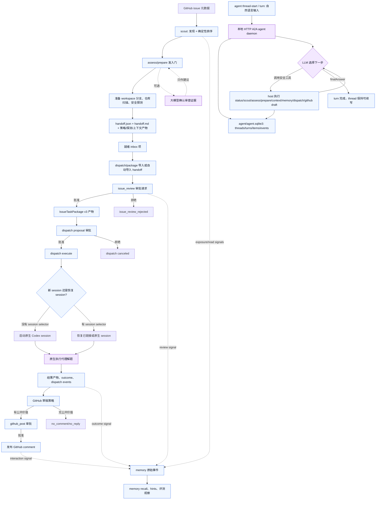

# 实现流程漂移审计

日期：2026-07-04
更新：2026-07-05，补入本地 Issue Finder agent daemon 的在线 A2A tool-loop 实现。

本审计对照当前 `main` 实现、当前面向用户/贡献者的文档、流程图资产和历史 spec。`docs/superpowers/specs/` 下的文档只作为设计档案，不作为当前行为的可执行真相。当前行为应优先以 `docs/usage.md`、`src/` 下 owner 模块和聚焦的运行时文档为准。

## 结论

当前实现已经明显超过最初的 handoff-only 模型。当前真相来源是：

- discovery、ranking 和 scout stats：`src/recommendation/*`、`src/workflow.rs`、`src/main.rs`
- prepare 边界和 handoff artifact：`src/prepare_gate.rs`、`src/handoff.rs`、`src/context_pack.rs`、`docs/agent-safe-preparation-runtime.md`
- dispatch/session/package runtime：`src/dispatch/*`、`docs/usage.md`
- online A2A agent daemon：`src/agent/*`
- memory runtime：`src/memory/*`
- JSON tool contract：`src/tool_specs.rs`、`src/tool_runtime.rs`、`src/dispatch/tool_specs.rs`、`src/dispatch/tools.rs`

## 漂移核对

| 范围 | 发现 | 当前处理 |
| --- | --- | --- |
| 缺失的审计文档 | 本次检查前，报告中提到的审计文件不在 `main`，也不在已 fetch 的任何远端 ref 中。 | 已在 `docs/development/` 下补充这份当前面向的审计文档。 |
| `scout --stats-json` | 该参数已在 `src/cli.rs` 和 `src/main.rs` 实现，`cargo run -- scout --help` 也会显示；`docs/usage.md` 之前只记录了 `--json`。 | 已更新 `docs/usage.md` 的常用命令和命令参考。 |
| direct dispatch 的 session 模式 | `DispatchRuntime::propose_dispatch` 在没有 session selector 时会使用 `start_session`。测试覆盖了省略 flag 的情形：`newSession=true`，`requestedNewSession=false`。 | 已在 `docs/usage.md` 记录 direct `dispatch <issue> --agent codex`，并说明 `--new-session` 只是默认新 session 行为的显式形式。 |
| `dispatch_propose` 命名 | CLI 支持 direct `dispatch <issue>` 和显式 `dispatch propose <issue>`。`tools list` 公开的是 `issue-finder.dispatch`，但 runtime 仍识别兼容用的 `issue-finder.dispatch_propose` 并进入同一个 handler。 | 将它视为隐藏/兼容 tool-contract alias，而不是隐藏 CLI alias；继续把 `dispatch propose` 作为显式 CLI 形式记录。 |
| 流程图中 handoff/package 的压缩表达 | 当前文档已说明 `handoff.json` 会先作为 issue review candidate 导入，审批后才写入 `IssueTaskPackage` v3。旧图会把这一步压缩为 package。 | 已在 `docs/usage.md` workflow 中拆出 issue review 和 package 创建，并在本文补充 Mermaid 当前实现流。 |
| `issue-finder-terminal.svg` | 该资产没有被当前文档引用，且 help 预览遗漏了当前命令和当前 wording。 | 已删除这个过时且未引用的资产。 |
| 长期和流程图资产 | `issue-finder-long-term-agent-architecture.svg/png`、`issue-finder-task-lifecycle.svg/png` 和 `issue-finder-execution-boundaries.svg/png` 当前未被文档引用，且混合了当前 runtime、未来/未接线能力或压缩的 package 语义。 | 已删除这些过时未引用资产；当前 flow 以本文 Mermaid 和 `docs/usage.md` 为准。 |
| hybrid memory spec | `docs/superpowers/specs/2026-06-18-hybrid-contribution-memory-design.md` 仍是历史设计 spec。当前 memory 行为在 `src/memory/*` 和 `docs/usage.md` 中。 | 继续通过 `docs/superpowers/README.md` 管理历史漂移；不要只为消除漂移去改 dated spec。 |
| online A2A agent daemon | 旧审计只覆盖 `dispatch a2a` 的本地 artifact 网关，没有正在运行的 Issue Finder agent。当前实现新增 `issue-finder agent daemon`、durable `agent thread-start/turn/thread-events`、兼容 `agent send/show/events`、`agent/agent.sqlite3` 和 SQLite-backed LLM tool loop。 | `docs/usage.md` 已将 `agent daemon` 和 `dispatch a2a` 分开记录：前者是在线自然语言 thread/turn 推送，后者仍是离线 package artifact 网关。 |

## 当前实现 Flow

## 真正的 Agent 判断点

handoff/dispatch 主流程仍不是自治模型 tool loop。多数步骤是确定性 workflow 或带审批的状态转换。当前真正有别于普通 workflow 的 agent 判断点集中在这些位置：

- `issue-finder agent daemon` 是在线本地 A2A agent loop：外部通过 `/a2a/threads/start` 新建 durable thread，通过 `/a2a/threads/{threadId}/turns/start` 追加 turn；旧 `/a2a/tasks/send` 只是兼容 shim。每个 turn 开始前都会从 SQLite 重建 thread transcript，LLM 再选择安全 Issue Finder 工具，如 `status`、`scout`、`assess`、`prepare`、`read_context`、memory/dispatch inspection 和 GitHub comment draft/list 工具，host 侧执行并把 observation 写回 transcript，直到模型输出 `finalAnswer`。
- 可选 LLM confirmation 可以审查 issue 价值证据，但它不是唯一 gate，失败也不会阻塞确定性的 handoff 生成。
- execution agent 只有在 dispatch approval 之后、原生 agent session 被启动或恢复时，才开始做解题判断。
- GitHub comment drafting 可以基于本地 policy 和 result context 判断是否值得提出公开评论，但发布仍需要审批。
- memory activation 和 hints 可以影响 recommendation context，但 raw memory events 仍是 append-only evidence，持久 write-back 受用户可见控制约束。

其余部分，包括 deterministic scout ranking、prepare probes、package creation、approval transitions、`dispatch a2a` artifact import/export 和 session link bookkeeping，更准确地说是 workflow/control-plane logic。`agent daemon` 可以调用 scout，但“是否调用 scout、何时结束、如何总结推荐”才是 LLM agent 判断；scout 的排序本身仍是确定性推荐 workflow。

## 后续边界

上述漂移项不要求代码变更。当前实现流已经在本文用 Mermaid 表达；如后续需要恢复图片资产，应从这个当前实现流重新生成，并把长期未来能力图单独标为 roadmap，不要混作当前实现文档。

在那之前，`docs/usage.md`、本文 Mermaid 和 owner modules 应被视为当前真相。
